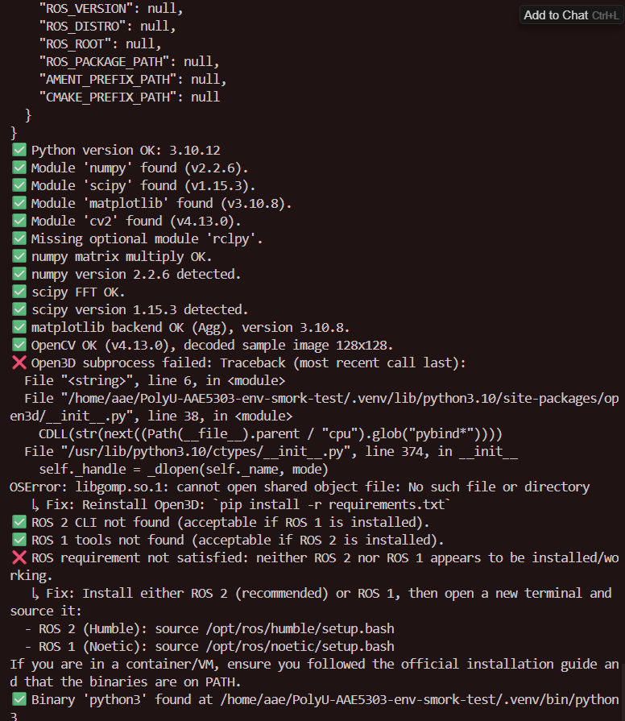
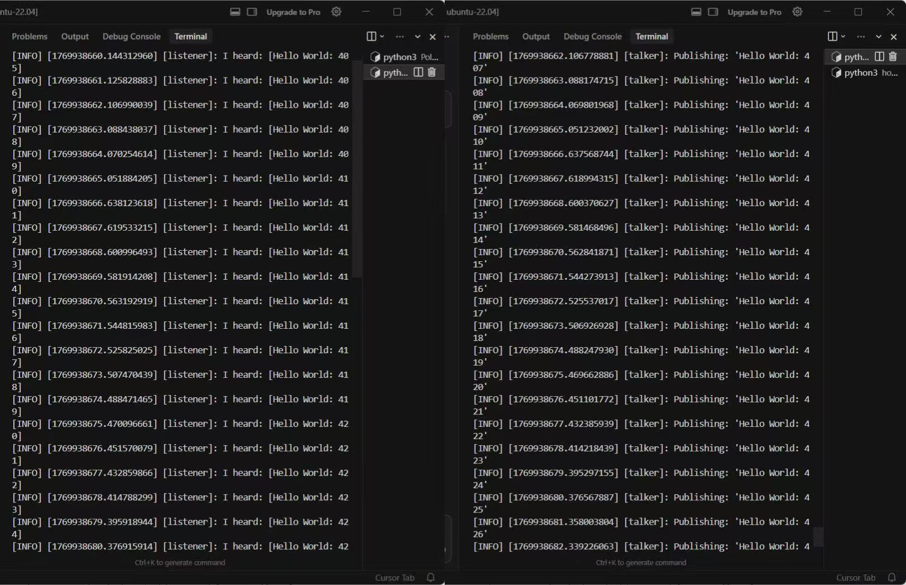

# AAE5303 Environment Setup Report — Template for Students

> **Important:** Follow this structure exactly in your submission README.  
> Your goal is to demonstrate **evidence, process, problem-solving, and reflection** — not only screenshots.

---

## 1. System Information

**Laptop model:**  
ASUS TUF GAMING F16

**CPU / RAM:**  
Intel(R) core(TM) i7-14650HX, 16GB RAM

**Host OS:**  
Windows 11

**Linux/ROS environment type:**  
- [ ] Dual-boot Ubuntu
- [✅] WSL2 Ubuntu
- [ ] Ubuntu in VM (UTM/VirtualBox/VMware/Parallels)
- [ ] Docker container
- [ ] Lab PC
- [ ] Remote Linux server

---

## 2. Python Environment Check

### 2.1 Steps Taken

Describe briefly how you created/activated your Python environment:

**Tool used:**  
venv

**Key commands you ran:**
```bash
python3 -m venv .venv
source .venv/bin/activate
pip install -r requirements.txt
```

**Any deviations from the default instructions:**  
None

### 2.2 Test Results

Run these commands and paste the actual terminal output (not just screenshots):

```bash
python scripts/test_python_env.py
```

**Output:**
```
========================================
AAE5303 Environment Check (Python + ROS)
Goal: help you verify your environment and understand what each check means.
========================================

Step 1: Environment snapshot
  Why: We capture platform/Python/ROS variables to diagnose common setup mistakes (especially mixed ROS env).
Step 2: Python version
  Why: The course assumes Python 3.10+; older versions often break package wheels.
Step 3: Python imports (required/optional)
  Why: Imports verify packages are installed and compatible with your Python version.
Step 4: NumPy sanity checks
  Why: We run a small linear algebra operation so success means more than just `import numpy`.
Step 5: SciPy sanity checks
  Why: We run a small FFT to confirm SciPy is functional (not just installed).
Step 6: Matplotlib backend check
  Why: We generate a tiny plot image (headless) to confirm plotting works on your system.
Step 7: OpenCV PNG decoding (subprocess)
  Why: PNG decoding uses native code; we isolate it so corruption/codec issues cannot crash the whole report.
Step 8: Open3D basic geometry + I/O (subprocess)
  Why: Open3D is a native extension; ABI mismatches can segfault. Subprocess isolation turns crashes into readable failures.
Step 9: ROS toolchain checks
  Why: The course requires ROS tooling. This check passes if ROS 2 OR ROS 1 is available (either one is acceptable).
Step 10: Basic CLI availability
  Why: We confirm core commands exist on PATH so students can run the same commands as in the labs.

=== Summary ===
✅ Environment: {
  "platform": "Linux-6.6.87.2-microsoft-standard-WSL2-x86_64-with-glibc2.35",
  "python": "3.10.12",
  "executable": "/home/aae/PolyU-AAE5303-env-smork-test/.venv/bin/python",
  "cwd": "/home/aae/PolyU-AAE5303-env-smork-test",
  "ros": {
    "ROS_VERSION": null,
    "ROS_DISTRO": null,
    "ROS_ROOT": null,
    "ROS_PACKAGE_PATH": null,
    "AMENT_PREFIX_PATH": null,
    "CMAKE_PREFIX_PATH": null
  }
}
✅ Python version OK: 3.10.12
✅ Module 'numpy' found (v2.2.6).
✅ Module 'scipy' found (v1.15.3).
✅ Module 'matplotlib' found (v3.10.8).
✅ Module 'cv2' found (v4.13.0).
✅ Missing optional module 'rclpy'.
✅ numpy matrix multiply OK.
✅ numpy version 2.2.6 detected.
✅ scipy FFT OK.
✅ scipy version 1.15.3 detected.
✅ matplotlib backend OK (Agg), version 3.10.8.
✅ OpenCV OK (v4.13.0), decoded sample image 128x128.
❌ Open3D subprocess failed: Traceback (most recent call last):
  File "<string>", line 6, in <module>
  File "/home/aae/PolyU-AAE5303-env-smork-test/.venv/lib/python3.10/site-packages/open3d/__init__.py", line 38, in <module>
    CDLL(str(next((Path(__file__).parent / "cpu").glob("pybind*"))))
  File "/usr/lib/python3.10/ctypes/__init__.py", line 374, in __init__
    self._handle = _dlopen(self._name, mode)
OSError: libgomp.so.1: cannot open shared object file: No such file or directory
   ↳ Fix: Reinstall Open3D: `pip install -r requirements.txt`
✅ ROS 2 CLI not found (acceptable if ROS 1 is installed).
✅ ROS 1 tools not found (acceptable if ROS 2 is installed).
❌ ROS requirement not satisfied: neither ROS 2 nor ROS 1 appears to be installed/working.
   ↳ Fix: Install either ROS 2 (recommended) or ROS 1, then open a new terminal and source it:
  - ROS 2 (Humble): source /opt/ros/humble/setup.bash
  - ROS 1 (Noetic): source /opt/ros/noetic/setup.bash
If you are in a container/VM, ensure you followed the official installation guide and that the binaries are on PATH.
✅ Binary 'python3' found at /home/aae/PolyU-AAE5303-env-smork-test/.venv/bin/python3

Environment check failed (2 issue(s)).

```

```bash
python scripts/test_open3d_pointcloud.py
```

**Output:**
```
Traceback (most recent call last):
  File "/home/aae/PolyU-AAE5303-env-smork-test/scripts/test_open3d_pointcloud.py", line 101, in <module>
    sys.exit(main())
  File "/home/aae/PolyU-AAE5303-env-smork-test/scripts/test_open3d_pointcloud.py", line 17, in main
    import open3d as o3d
  File "/home/aae/PolyU-AAE5303-env-smork-test/.venv/lib/python3.10/site-packages/open3d/__init__.py", line 38, in <module>
    CDLL(str(next((Path(__file__).parent / "cpu").glob("pybind*"))))
  File "/usr/lib/python3.10/ctypes/__init__.py", line 374, in __init__
    self._handle = _dlopen(self._name, mode)
OSError: libgomp.so.1: cannot open shared object file: No such file or directory
```

**Screenshot:**  



---

## 3. ROS 2 Workspace Check

### 3.1 Build the workspace

**Expected output:**
```
Summary: 1 package finished [x.xx s]
```

**Your actual output:**

Summary: 1 package finished [8.79s]


### 3.2 Run talker and listener

Show both source commands:

```bash
source /opt/ros/humble/setup.bash
source install/setup.bash
```

**Then run talker:**
```bash
ros2 run env_check_pkg talker.py
```

**Output (3–4 lines):**
```
[INFO] [1769939037.519292621] [talker]: Publishing: 'Hello World: 782'
[INFO] [1769939038.494119237] [talker]: Publishing: 'Hello World: 783'
[INFO] [1769939039.469056750] [talker]: Publishing: 'Hello World: 784'
[INFO] [1769939040.443675880] [talker]: Publishing: 'Hello World: 785'
```

**Run listener:**
```bash
ros2 run env_check_pkg listener.py
```

**Output (3–4 lines):**
```
[INFO] [1769939036.539810574] [listener]: I heard: [Hello World: 781]
[INFO] [1769939037.519687675] [listener]: I heard: [Hello World: 782]
[INFO] [1769939038.494624840] [listener]: I heard: [Hello World: 783]
[INFO] [1769939039.469475526] [listener]: I heard: [Hello World: 784]
```

**Alternative (using launch file):**
```bash
ros2 launch env_check_pkg env_check.launch.py
```

**Screenshot:**  


## 4. Problems Encountered and How I Solved Them

> **Note:** Write 2–3 issues, even if small. This section is crucial — it demonstrates understanding and problem-solving.

### Issue 1: Python virtual environment could not be created (`.venv` not found)

**Cause / diagnosis:**  
When running `python3 -m venv .venv`, the virtual environment directory was not created. This was because the `python3-venv` package was not installed by default in the WSL Ubuntu environment, which is required for creating Python virtual environments.

**Fix:**  
Install the missing system package `python3-venv`, then recreate the virtual environment.

```bash
sudo apt update
sudo apt install -y python3-venv
python3 -m venv .venv
source .venv/bin/activate
```


**Reference:**  
Ubuntu official documentation, AI assistant

---

### Issue 2:ROS2 workspace build failed due to Python venv conflict

**Cause / diagnosis:**  
The ROS2 workspace was built while the Python virtual environment (`.venv`) was activated. As a result, `colcon` used the Python interpreter from the virtual environment instead of the system Python, causing missing ROS-related Python modules such as `catkin_pkg`.

**Fix:**  
Deactivate the virtual environment, ensure the system Python is used, install the missing system dependency, clean the workspace, and rebuild.

```bash
deactivate
sudo apt install -y python3-catkin-pkg
rm -rf build install log
source /opt/ros/humble/setup.bash
colcon build
```

**Reference:**  
ROS2 official documentation, AI assistant

---

### Issue 3 (Optional):ROS2 commands not available in new terminal

**Cause / diagnosis:**  
After opening a new terminal, ROS2 commands such as `ros2` were not available. This happened because the ROS2 environment setup script had not been sourced in the new terminal session.

**Fix:**  
Source the ROS2 setup script before running any ROS2 commands.

```bash
source /opt/ros/humble/setup.bash
echo "source /opt/ros/humble/setup.bash" >> ~/.bashrc
```

**Reference:**  
ROS2 official documentation
---

## 5. Use of Generative AI (Required)

### 5.1 Exact prompt you asked

**Your prompt:**

I encountered an error when building a ROS2 workspace with colcon. The error says "ModuleNotFoundError: No module named 'catkin_pkg'", and the log shows that colcon is using the Python interpreter inside my virtual environment (.venv). How can I fix this issue in ROS2 Humble on Ubuntu 22.04?

---

### 5.2 Key helpful part of the AI's answer

**AI's response (relevant part only):**

The error occurs because colcon is using the Python interpreter from the virtual environment instead of the system Python required by ROS2. You should deactivate the virtual environment, ensure that the system Python is used, install the missing system dependency `python3-catkin-pkg`, clean the build directory, and rebuild the workspace after sourcing the ROS2 environment.

---

### 5.3 What you changed or ignored and why

**Your explanation:**

The AI suggested deactivating the virtual environment and rebuilding the workspace using the system Python, which I followed. I verified that the Python interpreter switched from `.venv/bin/python3` to `/usr/bin/python3` before rebuilding. I also checked the official ROS2 documentation to confirm that ROS2 workspaces should not be built inside a Python virtual environment. No unsafe commands were suggested, and the solution was consistent with official ROS2 guidelines.

---

### 5.4 Final solution you applied

```bash
deactivate
sudo apt install -y python3-catkin-pkg
rm -rf build install log
source /opt/ros/humble/setup.bash
colcon build


## 6. Reflection (3–5 sentences)

Short but thoughtful:

- What did you learn about configuring robotics environments?
- What surprised you?
- What would you do differently next time (backup, partitioning, reading error logs, asking better AI questions)?
- How confident do you feel about debugging ROS/Python issues now?

**Your reflection:**


Through this assignment, I learned that configuring a robotics environment requires careful separation between system-level tools (ROS2) and project-level Python environments, as mixing them can easily cause hidden dependency issues. I was surprised by how small environment details, such as which Python interpreter is used, can lead to build failures that are not immediately obvious from the error message. Next time, I would read error logs more carefully and verify environment variables earlier before attempting multiple fixes. Overall, I feel more confident now in debugging ROS2 and Python issues systematically rather than relying on trial and error.


---

## 7. Declaration

✅ **I confirm that I performed this setup myself and all screenshots/logs reflect my own environment.**

**Name:**  
WANG Qianlin

**Student ID:**  
25060282g

**Date:**  
2026/2/1

---

## Submission Checklist

Before submitting, ensure you have:

- [✅] Filled in all system information
- [✅] Included actual terminal outputs (not just screenshots)
- [✅] Provided at least 2 screenshots (Python tests + ROS talker/listener)
- [✅] Documented 2–3 real problems with solutions
- [✅] Completed the AI usage section with exact prompts
- [✅] Written a thoughtful reflection (3–5 sentences)
- [✅] Signed the declaration

---

**End of Report**
